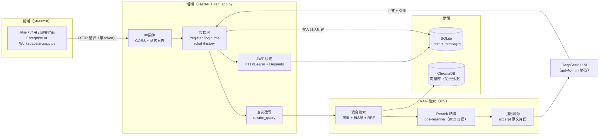

# 项目架构图（初稿 · W5 D3 · 8/11）

> Enterprise AI Workspace：金融顾问 AI 工作台。前端 Streamlit ↔ 后端 FastAPI ↔ RAG 检索 ↔ DeepSeek。
> 版本：初稿 0.1（8/11 建立），8/12-13 界面打磨时同步修订。

---

## 分层说明

| 层 | 组件 | 职责 | 关键代码 |
|----|------|------|---------|
| 前端 | Streamlit | 登录/注册/提问/历史展示/引用卡片 | `src/app.py` |
| 认证 | JWT | 登录签发 token，请求带 token 验身份 | `auth.py`、`HTTPBearer + Depends` |
| 中间件 | CORS + 日志 | 跨域放行 + 请求耗时记录 | `@app.middleware` |
| 接口层 | FastAPI | 6 个接口，Pydantic 校验 | `rag_app.py` |
| 查询改写 | rewrite_query | 有历史时用 LLM 补全省略句 | `rewrite_query()` |
| 检索 | 混合检索 | 向量（语义）+ BM25（关键词）+ RRF 融合 | `src/retriever.py` |
| 精排 | Rerank（计划） | 对 top50 重新打分取 top5 | `bge-reranker-base`（8/12） |
| 向量库 | ChromaDB | 父子分块向量存储 | `chroma_db/` |
| 生成 | DeepSeek | 基于检索上下文生成回答 + 引用 | `src/rag_pipeline.py` |
| 业务库 | SQLite | 用户 + 对话历史 | `db.py` |

---

## 一条完整请求的路径（叙事）

1. 用户在浏览器注册/登录 → 后端验密码 → 签发 JWT 存前端
2. 用户提问 → 前端把 token + 问题发给 `/chat`
3. 中间件记日志 → JWT 验身份（无 token 403 / token 坏 401）
4. 有历史 → 查询改写补全问题（如"那净利润呢"→完整问句）
5. 混合检索：向量 + BM25 各召回 → RRF 融合排名 →（8/12 起）Rerank 精排
6. 取父块上下文 + 引用来源 → 喂 DeepSeek → 返回回答 + 引用 excerpt
7. 回答写入 SQLite 历史表 → 前端展示回答 + 引用卡片

---

## 待办（并入 8/12-14）

- [ ] 8/12：Rerank 接入（`src/retriever.py` + 模型下载）
- [ ] 8/12-13：界面打磨后更新本图（前端流程细节）
- [ ] 8/14：演示准备前终稿
- [ ] W7：部署上线后补"部署环境"层（Streamlit Cloud / Docker）